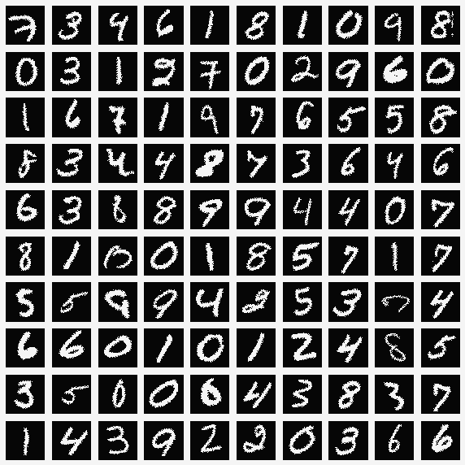

PHYS710 Term Project: 
------------------------------------------------------------------------------
This study benchmarks both classical and quantum-aware optimization methods for training a hybrid quantum-classical neural network (QMLP) on the MNIST dataset. The model replaces the hidden layer of a classical multi-layer perceptron (MLP) with a variational quantum circuit (VQC), which is implemented using PennyLane and integrated with PyTorch. 
In this analysis, classical optimizers such as Adam and stochastic gradient descent (SGD) are compared with gradient-free, quantum-aware methods like SPSA and COBYLA under near-term intermediate-scale quantum (NISQ) simulation settings. The results indicate that classical optimizers achieve higher accuracy and more stable convergence. In contrast, quantum-aware methods struggle with issues of instability and sensitivity.

Dataset
-------
In this study, we used the well-known MNIST dataset, which consists of 70,000 grayscale images of handwritten digits from 0 to 9. Each image has a spatial resolution of $28 \times 28$ pixels. The dataset is split into 60,000 training samples and 10,000 test samples.

                           
                             
|  

This project builds on the QMLP architecture [1], with implementation adapted from the original repository chuchengc/QMLP.

Installation
------------

First, clone this repository and enter the directory by running:

    git clone https://github.com/eozkaynar/Quantum-Machine-Learning

Then it is recommended to set up a virtual environment
    

Code dependencies can be installed using

    pip install -r 'requirements.txt'

Then you should install the model MQO using

    pip install .

Usage
-----

### Running Code

#### You can train the QMLP model with different optimizers by running the main training script:

    python MQO/training/train_quantum.py --optimizer <optimizer_name>

Available optimizers
  - adam – Classical optimizer (gradient-based)
  - sgd – Classical optimizer (gradient-based)
  - spsa – Quantum-aware, gradient-free optimizer
  - cobyla – Quantum-aware, constraint-based optimizer

#### Example

    python MQO/training/train_quantum.py --optimizer cobyla --num_epochs 30 --batch_size 16

Results including accuracy, training time, and loss plots are saved under:
  output/quantum/
and log files are stored at:
  output/quantum/logs/

## References

<a name="ref1">[1]</a> C. Zhang, X. Yang, Y. Liu, D. Liang, and D. Liu, “QMLP: Quantum-Inspired MLP for Vision Classification,” *arXiv preprint arXiv:2206.01345*, 2022. [Online]. Available: https://arxiv.org/abs/2206.01345
